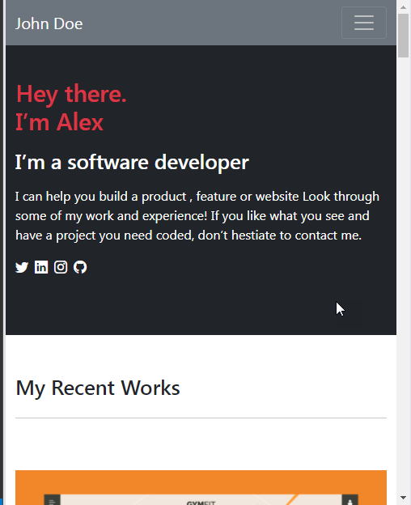

# Portfolio_with_bootstrap

> Portfolio with Bootstrap 5

Portfolio project based on HTML and Bootstrap five developed using pair-programming.

## Built With

- HTML and Bootstrap 5

## Live Demo

[Live Demo Link](https://gtekle.github.io/Portfolio_with_bootstrap/)

## Getting Started

-Install Bootstrap 5
-Install text editor of your choice (eg. VS Code)

## Authors

👤 ** Jihane Haddad **

- GitHub: [@githubhandle](https://github.com/jihaneH)
- Twitter: [@twitterhandle](https://twitter.com/jijihaddad)
- LinkedIn: [LinkedIn](https://linkedin.com/in/jihane-haddad/)

👤 **Tekle G**

- GitHub: [@githubhandle](https://github.com/gtekle)
- LinkedIn: [LinkedIn](www.linkedin.com/in/tekle-gebreyohannes-kidanemariam-7605752b)

## 🤝 Contributing

Contributions, issues, and feature requests are welcome!

Feel free to check the [issues page](../../issues/).

## Show your support

Give a ⭐️ if you like this project!

## Acknowledgments

- Microverse Inc

## 📝 License

This project is [MIT](./MIT.md) licensed.
